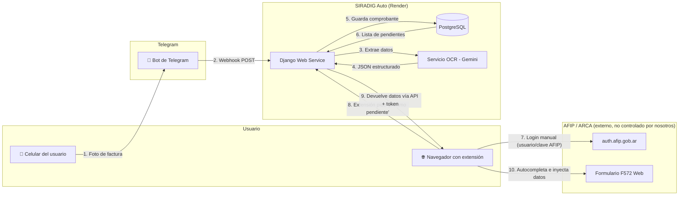
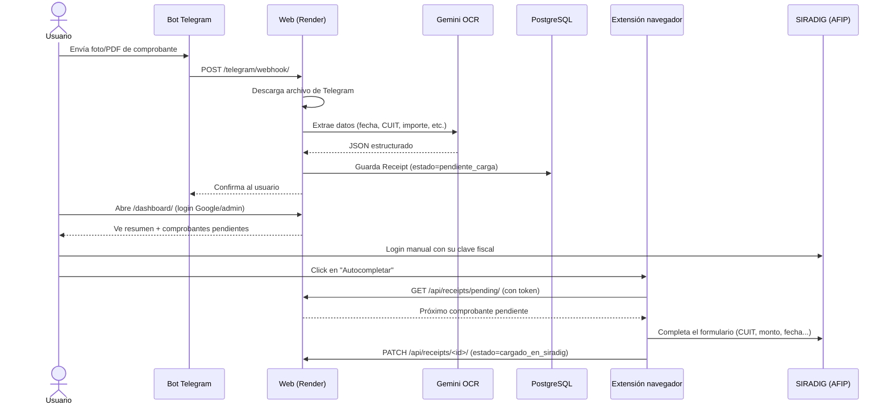
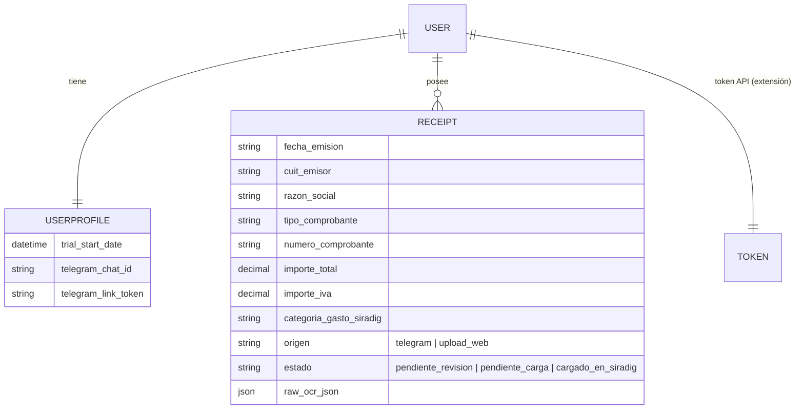

# SIRADIG Auto

Aplicación web para automatizar la carga de deducciones en el **Formulario 572 web (SIRADIG)** de AFIP/ARCA. Los usuarios envían fotos de sus comprobantes por Telegram, un OCR con IA extrae los datos, y quedan disponibles en un dashboard para cargarlos en SIRADIG con ayuda de una extensión de navegador.

> **Principio clave de seguridad**: esta app **nunca** maneja las credenciales de AFIP/ARCA. El usuario siempre inicia sesión manualmente en el sitio oficial.

## Arquitectura general



## Flujo end-to-end (paso a paso)



## Componentes

| Componente | Tecnología | Rol |
|---|---|---|
| **Backend web** | Django 6 + Django REST Framework | Dashboard, API, lógica de negocio |
| **Base de datos** | PostgreSQL (Render) | Usuarios, comprobantes, tokens |
| **OCR / extracción de datos** | Google Gemini (`google-genai`) | Lee la factura y devuelve JSON estructurado |
| **Ingesta de comprobantes** | Bot de Telegram (webhook) | Canal por el que el usuario manda fotos/PDFs |
| **Autenticación de usuarios** | django-allauth (Google OAuth) | Login del dashboard |
| **Autenticación de la extensión** | DRF Token Authentication | La extensión usa un token propio, no la sesión del usuario |
| **Autocompletado en SIRADIG** | Extensión de navegador (Manifest V3) — *en desarrollo* | Content script que llena el formulario real de AFIP |
| **Hosting** | Render (Web Service + PostgreSQL) | Deploy continuo desde GitHub |

## Modelo de datos (simplificado)



## Estructura del proyecto

```
core/                   # Configuración Django (settings, urls, wsgi)
receipts/               # App principal
├── models.py           # UserProfile, Receipt
├── views.py            # dashboard, webhook de Telegram, API DRF
├── serializers.py       # Serializers DRF
├── signals.py           # Auto-crea UserProfile + Token al registrar un usuario
├── services/
│   ├── ocr.py           # Integración con Gemini (con fallback de modelos)
│   └── telegram.py      # Wrapper de la API de Telegram (mensajes, archivos, webhook)
├── management/commands/
│   └── set_telegram_webhook.py  # Configura el webhook en cada deploy
└── templates/receipts/dashboard.html

Proof of Concept/       # Scripts originales que validaron la idea (Gemini OCR, Playwright)
render.yaml             # Blueprint de despliegue en Render
.env.example            # Variables de entorno necesarias (plantilla, sin secretos)
```

## Estado actual del MVP

- ✅ Login (Google OAuth vía allauth, + acceso admin para pruebas)
- ✅ Bot de Telegram → descarga de archivo → OCR con Gemini → guardado en base de datos
- ✅ Dashboard con resumen de comprobantes, link de vinculación de Telegram y token de extensión
- ✅ API (`/api/receipts/pending/`, `/api/receipts/<id>/`) lista para ser consumida por la extensión
- ✅ Desplegado en Render (`https://siradig.onrender.com`) con PostgreSQL
- ⏳ Extensión de navegador (Manifest V3) para autocompletar el formulario real de SIRADIG — MVP acotado a la categoría **"Gastos de Adquisición de Indumentaria y Equipamiento"**
- 🔜 Fuera de alcance por ahora: pagos (MercadoPago), WhatsApp como canal de ingesta, cola asíncrona (Celery/Redis), publicación en Chrome Web Store

## Variables de entorno

Ver [`.env.example`](.env.example). Nunca commitear valores reales — usar `.env` local (ignorado por git) o las variables de entorno del servicio en Render.

## Despliegue

El despliegue está automatizado vía GitHub → Render. El `render.yaml` define el Blueprint (Web Service + PostgreSQL); el build ejecuta migraciones, recolecta estáticos, crea un superusuario de prueba y configura el webhook de Telegram automáticamente en cada deploy.
